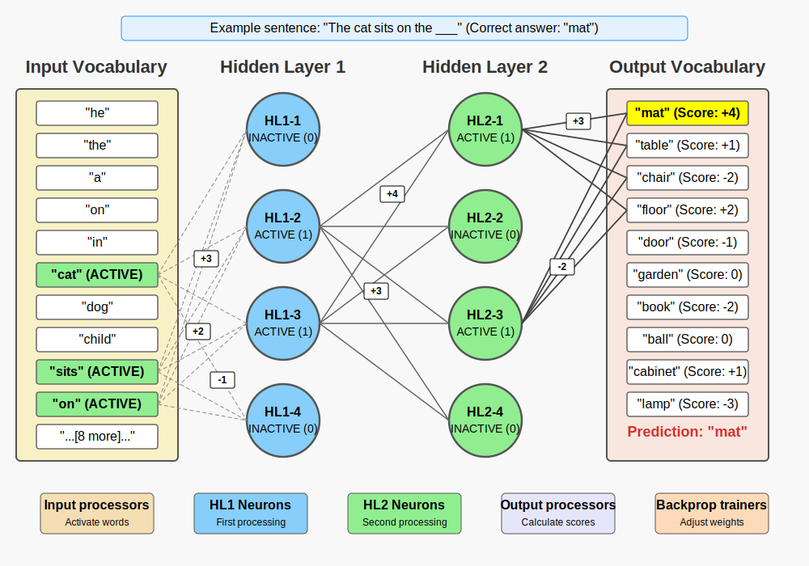

# Words Humans Yield game

## Game Concept

An interactive workshop where participants play the role of a Large Language Model (LLM) to learn how AI language models
work. Players collectively form a neural network that predicts text, giving them insight into how neural networks
function, the difference between training and inference, and how language models learn from data.

**Duration:** 75 minutes **Players:** 10-25 people

## Learning Objectives

- Understanding how a neural network works at a basic level
- Distinguishing between training and inference
- Insight into weights and backpropagation
- Importance of training data
- Evaluation of model performance

## Materials Needed

### Core Materials

- 20 input word cards (A5-format)
- 10 output word cards (A5-format)
- 250 weight cards (numbers from -5 to +5, multiple of each)
- 175 connection cords (strings of 1-2 meters, different colors)
- 20 role cards with instructions
- 10 training data cards with example sentences
- 1 large whiteboard or flipchart for network status and scores

### Additional Materials

- Green and red dots (to indicate active/inactive status of input words)
- Small whiteboards or clipboards with paper for calculations
- Adhesive tape to secure connections
- Stands to place word cards upright
- Name stickers for participants
- Markers and pens
- Clipboard for the evaluator

## Vocabulary

### Input Vocabulary (20 words)

1. he
2. the
3. a
4. on
5. in
6. under
7. next to
8. cat
9. dog
10. child
11. plant
12. car
13. sits
14. stands
15. lies
16. plays
17. walks
18. big
19. small
20. red

### Output Vocabulary (10 words)

1. mat
2. table
3. chair
4. floor
5. door
6. garden
7. book
8. ball
9. cabinet
10. lamp

## Network Architecture

- **Input layer:** 20 word cards with connections to HL1
- **Hidden Layer 1 (HL1):** 3-5 neurons (human players)
- **Hidden Layer 2 (HL2):** 3-5 neurons (human players)
- **Output layer:** 10 word cards with connections to HL2

The network is **fully connected**, which means that:

- Every input word is connected (with strings) to ALL neurons in Hidden Layer 1
- Every neuron in Hidden Layer 1 is connected to ALL neurons in Hidden Layer 2
- Every neuron in Hidden Layer 2 is connected to ALL output words



## Role Distribution (10-25 players)

| Role                     | Min. players | Max. players | Description                                          |
|--------------------------|--------------|--------------|------------------------------------------------------|
| Input processors         | 1            | 2            | Activate input words based on training sentences     |
| Hidden Layer 1           | 3            | 5            | Process signals from the input layer                 |
| Hidden Layer 2           | 3            | 5            | Process signals from Hidden Layer 1                  |
| Output processors        | 1            | 2            | Calculate scores for output words                    |
| Training data providers  | 1            | 2            | Provide example sentences                            |
| Evaluators               | 1            | 1            | Assess predictions and keep score                    |
| Backpropagation trainers | 1            | 2            | Adjust weights after incorrect predictions           |
| Network managers         | 1            | 2            | Keep track of all weights and help with calculations |
| Game leaders             | 1            | 2            | Explain, keep time, facilitate discussion            |

*Note: With fewer than 13 players, roles can be combined, for example input processors and training data providers, or
backpropagation trainers and network managers.*

## Instruction Cards

### Input Processor

```text
ROLE: INPUT PROCESSOR

Your task is to activate the appropriate input words based on the training sentences.

INSTRUCTIONS:
1. Listen to the sentence from the training data provider
2. Identify which words from the input vocabulary appear in the sentence
3. Mark these word cards as ACTIVE (1) with a green dot
4. All other word cards remain INACTIVE (0) (no dot)
5. Clearly announce which words are active:
   "The following words are active: [word1], [word2]..."
6. Make sure all hidden layer 1 neurons can see which input words are active

EXAMPLE:
For the sentence "The cat sits on the mat":
- Active words: "the", "cat", "sits", "on"
- Inactive words: all others

For each new training sentence: First reset all words to inactive (0).
```

### Hidden Layer 1 Neuron

```text
ROLE: HIDDEN LAYER 1 NEURON

You are a processing neuron in the first hidden layer of the network.

INSTRUCTIONS:
1. Receive signals from all ACTIVE input words you are connected to
2. For each active word:
   a. Note the weight on the connection between you and that word
   b. Multiply the activation (always 1) by that weight
3. Sum up all these weighted signals
4. If your total sum > 0: You are ACTIVE (1)
   If your total sum ≤ 0: You are INACTIVE (0)
5. Show your status (ACTIVE/INACTIVE) with a green or red card
6. Announce your status: "Hidden Neuron 1-[X] is [active/inactive]"
7. Send your activation to all neurons in Hidden Layer 2

Use the whiteboard to show your calculation:
Input word 1 (1) × weight (+2) = +2
Input word 2 (1) × weight (-1) = -1
...
Total: +1 → ACTIVE (1)
```

### Hidden Layer 2 Neuron

```text
ROLE: HIDDEN LAYER 2 NEURON

You are a processing neuron in the second hidden layer of the network.

INSTRUCTIONS:
1. Receive signals from all ACTIVE neurons in Hidden Layer 1
2. For each active HL1 neuron:
   a. Note the weight on the connection between you and that neuron
   b. Multiply the activation (always 1) by that weight
3. Sum up all these weighted signals
4. If your total sum > 0: You are ACTIVE (1)
   If your total sum ≤ 0: You are INACTIVE (0)
5. Show your status (ACTIVE/INACTIVE) with a green or red card
6. Announce your status: "Hidden Neuron 2-[X] is [active/inactive]"
7. Send your activation to the output layer

Use the whiteboard to show your calculation:
HL1 Neuron 1 (1) × weight (+3) = +3
HL1 Neuron 2 (0) × weight (+1) = 0
...
Total: +3 → ACTIVE (1)
```

### Output Processor

```text
ROLE: OUTPUT PROCESSOR

You calculate prediction scores for output words based on signals from Hidden Layer 2.

INSTRUCTIONS:
1. Wait until the Hidden Layer 2 neurons have passed on their activations
2. For each output word, calculate the total score:
   a. Check which HL2 neurons are ACTIVE (value 1)
   b. For each active HL2 neuron, note the weight to the output word
   c. Sum up all weights from active HL2 neurons
3. Write the total score next to each output word
4. Identify the output word with the highest score
5. Clearly announce: "The network predicts the word: [output word] with score [score]"
6. In case of equal highest scores, choose the word that comes first alphabetically

EXAMPLE:
"mat": HL2-1(1)×(+3) + HL2-2(0)×(+1) + HL2-3(1)×(-2) = +1
"table": HL2-1(1)×(-1) + HL2-2(0)×(+4) + HL2-3(1)×(+5) = +4
Prediction: "table" with score +4
```

### Training Data Provider

```text
ROLE: TRAINING DATA PROVIDER

You provide example sentences to train or test the network.

INSTRUCTIONS:
1. Choose a training card with an incomplete sentence
2. Announce: "New training round" (or "New test phase" during inference)
3. Read the sentence clearly, without revealing the last word
   E.g. "The cat sits on the ___"
4. Wait until the input processors have marked all active words
5. Wait until the model has made a prediction
6. Reveal the correct answer: "The correct answer is: [word]"
7. Pass the result to the evaluator

TIP: During the training phase, start with simple sentences where the pattern is clear.
During the test phase, you can vary to test if the network has generalized.
```

### Evaluator

```text
ROLE: EVALUATOR

You assess how well the network performs and keep track of scores.

INSTRUCTIONS:
1. Listen to the prediction from the output processor
2. Compare it with the correct answer from the training data provider
3. Determine if the prediction is correct
4. Announce the result: "The prediction is [CORRECT/INCORRECT]"
5. Keep track of scores on the scoreboard:
   a. Note the training sentence (e.g. "The cat sits on the ___")
   b. Note the predicted word
   c. Note the correct word
   d. Mark as correct (✓) or incorrect (✗)
6. For incorrect predictions, signal the backpropagation trainers
   to adjust the weights

TIP: After multiple training rounds, also keep track of the total score:
"The network now performs [X] out of [Y] correctly ([Z]%)."
```

### Backpropagation Trainer

```text
ROLE: BACKPROPAGATION TRAINER

You adjust weights to improve the network after incorrect predictions.

INSTRUCTIONS:
1. After an incorrect prediction, analyze what went wrong:
   a. Which word was the correct answer?
   b. Which word was incorrectly predicted?
   c. Which neurons in HL2 were active or inactive?

2. Strategically choose 3-5 weights to adjust:
   a. STRENGTHEN connections between active HL2 neurons and the correct output word
      (increase weight by +1 or +2)
   b. WEAKEN connections between active HL2 neurons and the incorrectly predicted output word
      (decrease weight by -1 or -2)
   c. If necessary, also adjust weights between HL1 and HL2

3. Announce your adjustments:
   "I am adjusting the following weights:
   - Connection from HL2-[X] to [correct word]: from [old] to [new]
   - Connection from HL2-[Y] to [incorrect word]: from [old] to [new]"

4. Work with the network manager to update the weight matrix

TIP: Focus on the most influential connections. Drastic changes can disrupt training.
```

### Network Manager

```text
ROLE: NETWORK MANAGER

You keep track of all network connections and weights and ensure correct information transfer.

INSTRUCTIONS:
1. At the start:
   a. Ensure all connections between layers are clearly visible
   b. Assign initial weights to all connections (between -2 and +2)
   c. Keep a matrix of all weights (e.g. on a large sheet of paper)

2. During training:
   a. Assist neurons with calculations if needed
   b. Check if information is being passed correctly
   c. Pay attention to activation patterns

3. After backpropagation:
   a. Update the weight cards on the relevant connections
   b. Update the weight matrix
   c. Announce important changes: "Note, these connections are now strengthened/weakened..."

4. Between training rounds:
   a. Reset all activations to inactive (0)
   b. Make sure everything is ready for the next round

TIP: Use a table/matrix with rows for sources and columns for targets to keep all weights organized.
```

### Game Leader

```text
ROLE: GAME LEADER

You guide the entire process, explain, keep time and facilitate discussion.

INSTRUCTIONS:
1. Start with an explanation of the concept (5-10 min):
   a. What is a neural network and how does it work?
   b. What are the different roles?
   c. How does information flow through the network?

2. Guide the network setup (5-10 min):
   a. Help participants find their position
   b. Ensure all connections are made
   c. Explain how weights work

3. Lead the training phase (30-35 min):
   a. Announce each new training sentence
   b. Pause regularly to explain concepts
   c. Ask targeted questions: "Why do you think this prediction was wrong?"

4. Lead the test phase (10-15 min):
   a. Explain how inference differs from training
   b. Test with new sentences
   c. Discuss results

5. Facilitate closing discussion (10 min):
   a. Ask for insights from participants
   b. Draw connections with real LLMs
   c. Answer questions

TIP: Keep the pace high, but take time for learning moments. Ensure a good balance between game and explanation.
```

## Example Sentences for Training and Testing

### Training Sentences (8)

1. "The cat sits on the ___" (mat)
2. "The child plays with the ___" (ball)
3. "The dog lies on the ___" (floor)
4. "The plant stands on the ___" (table)
5. "The child stands next to the ___" (door)
6. "The cat plays in the ___" (garden)
7. "The big dog sits under the ___" (table)
8. "The child reads a ___" (book)

### Test Sentences (4)

1. "The small cat lies on the ___" (mat)
2. "The child stands on the ___" (chair)
3. "The red car stands next to the ___" (door)
4. "The dog plays with the ___" (ball)

## Game Flow and Time Schedule (75 minutes)

### 1. Introduction and Explanation (10 min)

- Welcome and overview of the game concept
- Explanation of neural networks, LLMs and learning objectives
- Assignment of roles to participants

### 2. Network Setup (10 min)

- Positioning of all players and cards
- Establishing connections between layers
- Assigning initial weights (randomly!)

### 3. First Training Phase (25 min)

- Training with 4 example sentences
- After each sentence: activation, calculation, prediction, evaluation
- For errors: backpropagation and weight adjustments

### 4. Second Training Phase (15 min)

- Training with 4 more complex example sentences
- Reinforcing patterns that work
- Refining weights

### 5. Test Phase (10 min)

- Testing with 4 new sentences
- No more weight adjustments
- Evaluation of performance

### 6. Reflection and Discussion (5 min)

- Discussion of learning moments
- Connections to real language models
- Questions and answers

## Tips for Facilitators

1. **Preparation**:
    - Test the game beforehand with a small group
    - Prepare the physical space so that the network diagram is clearly visible
    - Create color-coded connections for better visualization

2. **During the Game**:
    - Start with simple examples
    - Take regular breaks to clarify concepts
    - Help with calculations where needed
    - Involve all participants through targeted questions

3. **Simplifications for Beginners**:
    - Start with smaller input and output vocabularies (e.g. 10 input, 5 output)
    - Begin with preset weights that work for the first sentence
    - Simplify the backpropagation process

4. **Challenges for Advanced Players**:
    - Add more complex sentences with multiple subjects
    - Introduce a validation set to demonstrate overfitting
    - Let players create their own training examples

5. **Conclusion**:
    - Summarize the key learning points
    - Compare with the scale of real LLMs (billions of parameters)
    - Point out the limitations of the model and how real LLMs work differently

## Technical Specification

The implemented model is a discrete feed-forward Multi-Layer Perceptron (MLP) with binary step-activation function (
Heaviside), structured as a 20-5-5-10 architecture without bias terms that uses direct, heuristic weight adjustments
instead of gradient-based backpropagation. Conceptually, it follows Rosenblatt's perceptron principles (1958) with
McCulloch-Pitts neurons and represents text via a bag-of-words approach without sequential information. The simplistic
weight adjustment bypasses differentiable functions and stochastic gradient descent that are common in modern networks (
Rumelhart et al., 1986). Crucial limitations include the absence of contextual connections (versus Transformers; Vaswani
et al., 2017), parameter-efficient backpropagation, and regularization techniques such as weight decay or dropout (
Srivastava et al., 2014), which makes the model susceptible to overfitting as demonstrated in the simulation results.
For modern NLP implementations, see Jurafsky & Martin (<https://web.stanford.edu/~jurafsky/slp3>), and for visual neural
network demonstrations: <https://playground.tensorflow.org>.
